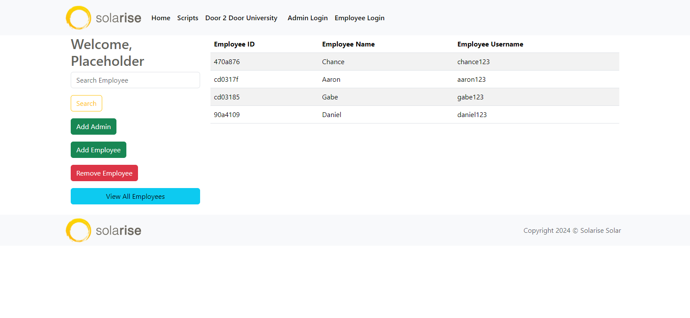

# Solarise-Training

## Description

A site for training new employees. The user will be required to log in as either an employee or administrator and be taken to their respective pages.

A logged in employee will be taken to the home modules page where they will have day by day training modules to complete in their first week.

A logged in admin will be taken to the admin page where they will be able to add new admins, add employees for new training, remove employees that are no longer with the company or have completed training, as well as view all employees that are currently working on the training.

## Screenshot

## Credits

> Backend Development: Gabe Latimer and Daniel Goss

> Frontend Development: Chance Creger and Aaron Lyman

## Links

Github Repo:

Deployed site:
